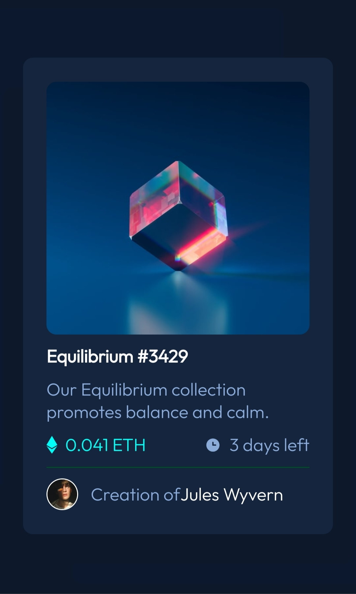

# Frontend Mentor - NFT preview card component solution

This is a solution to the [NFT preview card component challenge on Frontend Mentor](https://www.frontendmentor.io/challenges/nft-preview-card-component-SbdUL_w0U). Frontend Mentor challenges help you improve your coding skills by building realistic projects. 

## Table of contents

- [Overview](#overview)
  - [The challenge](#the-challenge)
  - [Screenshot](#screenshot)
  - [Links](#links)
- [My process](#my-process)
  - [Built with](#built-with)
  - [What I learned](#what-i-learned)
  - [Continued development](#continued-development)
- [Author](#author)

## Overview

### The challenge

Users should be able to:

- View the optimal layout depending on their device's screen size
- See hover states for interactive elements

### Screenshot



### Links

- Solution URL: (https://github.com/S-chinGurjar/nft-preview/)
- Live Site URL: [Add live site URL here](https://your-live-site-url.com)

## My process

### Built with

- Semantic HTML5 markup
- CSS custom properties
- Flexbox
- CSS Grid
- Mobile-first workflow

### What I learned

I learned building responsive webpages using media queries. Using (margin:auto;)
properly. Got comfortable with FLEXBOX .

```html
<svg width="85%" height="100%">
                <rect width="100%" height="100%" 
         x="0" y="0" fill=" hsla(178, 100%, 50%,0)"/>
</svg>
```
```css
.main{
    box-shadow:20px 30px hsl(216, 54%, 11%),-20px 30px hsl(216, 54%, 11%),
    50px 50px hsl(217,60%,11%),-50px -50px hsl(217,60%,11%);    
.img-container svg:hover ~ .eye-icon{
    visibility:visible;
}
```

### Continued development
I would like to find new ways to develope hover state for nft image.

## Author

- Website - [Sachin](https://github.com/S-chinGurjar/)
- Frontend Mentor - [@S-chinGurjar](https://www.frontendmentor.io/profile/S-chinGurjar)
